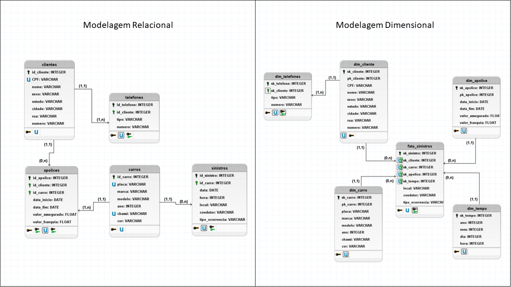

 
 
 # Projetos do Bootcamp Engenharia de Dados da XP Educação (IGTI) 

O Seguinte repositório tem como objetivo apresentar os projetos realizados durante o Bootcamp de Engenharia de Dados da XP Educação (IGTI).

Todos os arquivos estão organizados nas pastas dos respectivos projetos e aqui se encontram os resumos de cada um deles.

<!-- colocar screenshoot do seu projeto -->

### Projeto 1 - Modelagem Conceitual, Lógica e Física de um BD de Empresa de Seguros

Neste projeto foi realizada a modelagem conceitual, lógica e física de um banco de dados relacional fictício para um empresa de seguros de carros e em seguida a dimensionalização desse banco de dados conforme a seguir:

* **Modelagem Conceitual (Relacional)** utilizando _brModelo_;
* **Modelagem Lógica (Relacional)** utilizando _brModelo_;
* **Modelagem Física (Relacional)** e criação do Banco de Dados utilizando _MySQL Workbench_ através de Script SQL;
* **Modelagem Dimensional** utilizando _brModelo_.

O enunciado, arquivos das modelagens e script de criação do banco de bados se encontram na pasta do ["Projeto 1"](https://github.com/brunoaugp/bootcamp_eng_dados/tree/master/Projeto1 "Link Projeto1").

(Modelagem Lógica Relacional e Dimensional - Projeto 1)

(...)

## Meta

Bruno Augusto Pinto --- [Linkedin](https://www.linkedin.com/in/brunoaugp/) --- brunoaugp@hotmail.com

<https://github.com/brunoaugp>

